# 密码学基础

## 4 消息认证和哈希函数

### 4.1 消息认证 Message Authentication

**加密**

- 抗击被动攻击（获取消息的内容、业务流分析）
- 保密性 Confidentiality

**消息认证**

- 抗击主动攻击（假冒、重放、消息篡改、业务拒绝）
- 真实性 Authenticity

对称加密不能保证真实性

- 流密码：主动攻击者通过置乱相应密文 bit，可以改变任意明文 bit。

- ECB 模式分组密码：攻击者记录一些过去的密文分组， 替代新的密文分组。如果分组消息之间不相关，接收者不可能检测到攻击。

公钥加密可以提供保密性，但不能提供认证

- 发方 Alice 采用收方 Bob 的公钥 $K_P^B$对消息 m 进行加密。只有 Bob 知道自己的私钥 $K_S^B$，故只有 Bob 才能对收到的消息准确解密。
- 任何人可以假冒 Alice，用 Bob 的公钥 $K_P^B$ 对消息 m 加密，因此不能确保发送者身份的真实性。

**认证方式的分类**

- **对称认证 Symmetric Authentication**

  通信双方相互信任的认证 （如企业内部人员之间）。

  主要防止来自第三方的攻击（如检查文件是否被人修改过）。

- **非对称认证 Asymmetric Authentication**

  通信双方相互不信任的认证（如商业伙伴之间）。

  主要防止来自对方的攻击（如查验收到的文件是否真实）。

### 4.2 Hash 函数

将任意长的数字串 m 映射为一个较短的定长的数字串 h。

- 目标：确定消息是否被修改。
- 攻击：修改消息后，Hash 值不变。

$h = H(m)$ 满足：

- m 任意长度，h 固定长度
- 快速性：$\forall\ m$，计算 h 容易
- 单向性：$\forall\ h$，计算 m 困难
- 弱抗碰撞性：已知 $m_1$，寻找 $m_2 \neq m_1$ 满足 $H(m_2) = H(m_1)$ 困难
- 强抗碰撞性：$\forall\ m_1$，寻找 $m_2 \neq m_1$ 满足 $H(m_2) = H(m_1)$ 困难

雪崩效应：m 发生很小的变动，引起 h 较大变动。

完全单向：已知 h 无法推算出 m，已知两个输出的差别无法推算出输入的差别。

**生日攻击**

生日问题：一个班级中至少要有多少学生，才能使有两个学生生日相同的概率大于 1/2。

消息摘要长 n 位，则候选消息总数 $2^n$ 个。检查约 $2^\frac{n}{2}$ 个消息，可使两条消息具有相同 Hash 值的概率大于 50%。

故能抵抗生日攻击的哈希函数的值至少为 128 bit。

**Hash Code 的分类**

- 校验和 Cyclic Redundancy Check
- 消息认证码 Message Authentication Code
- 消息检测码 Message Detection Code
- 无碰撞性 Hash 函数 Collision Free Hash Function

### 4.3 MAC and MDC

#### 消息认证码 Message Authentication Code

带密钥的 Hash 函数。密码校验和。

消息被由密钥控制的公开函数作用后，产生的用作认证符的定长数值。

消息的真实性转化为安全建立共享密钥的问题。

- 认证性

  发送 $\{M\ ||\ C_k(M)\}$，收到后计算 $MAC'=C_k(M)$ ，判断是否与 MAC 相等。

- 认证性和保密性（对明文认证）

  发送 $E_{K2}\{M\ ||\ C_{k1}(M)\}$，收到后解密，计算 $MAC'=C_{k1}(M)$ ，判断是否与 MAC 相等。

- 认证性和保密性（对密文认证）

  发送 $\{E_{K2}(M)\ ||\ C_{k1}(E_{k2}(M)\}$，收到后计算 $MAC'=C_{k1}(E_{k2}(M))$ ，判断是否与 MAC 相等。
  

#### 消息检测码 Message Detection Code

不带密钥的 Hash 函数。篡改检测码。

验证消息完整性。

消息的真实性转化为检验定长比特串的真实性。

需要认证信道传输，且应为抗碰撞的 Hash 函数。

发送 $\{m,H(m)\}$，收到后计算 $MDC'=H(m)$ ，判断是否与 MDC 相等。

若消息很长，MDC 可迭代构造。消息 X 分为 t 组，填充 padding，IV 为初始向量，f 为轮函数，g 为输出变换：
$$
h_0=IV,\quad h_i=f(X_i,h_{i-1}),\quad ...\\
H(X)=g(h_t)
$$

### 4.3 常用哈希函数

#### MD5

Message Digest 消息摘要，用于验证信息传输完整一致。

算法中每分组长 512 bits，再分为 16 × 32 bits 的子组。

输出由 4 个 32 bits 组成的 128 bits。

1. **填充**

   在消息后填充一个“1”和多个“0”，至 n × 512 bits - 64 bits。最后附上 64 bits 二进制最低有效字节优先表示的 $mod\  2^{64}$ 消息长度。

2. **初始化缓冲区**

   缓冲区由 4 个 32 bits 寄存器 A, B, C, D 组成，最低有效字节优先方式初始化为 A = 01 23 45 67, B = 89 AB CD EF, C = FE DC BA 98, D = 76 54 32 10。

3. **主循环**

   4 rounds × 16 steps

   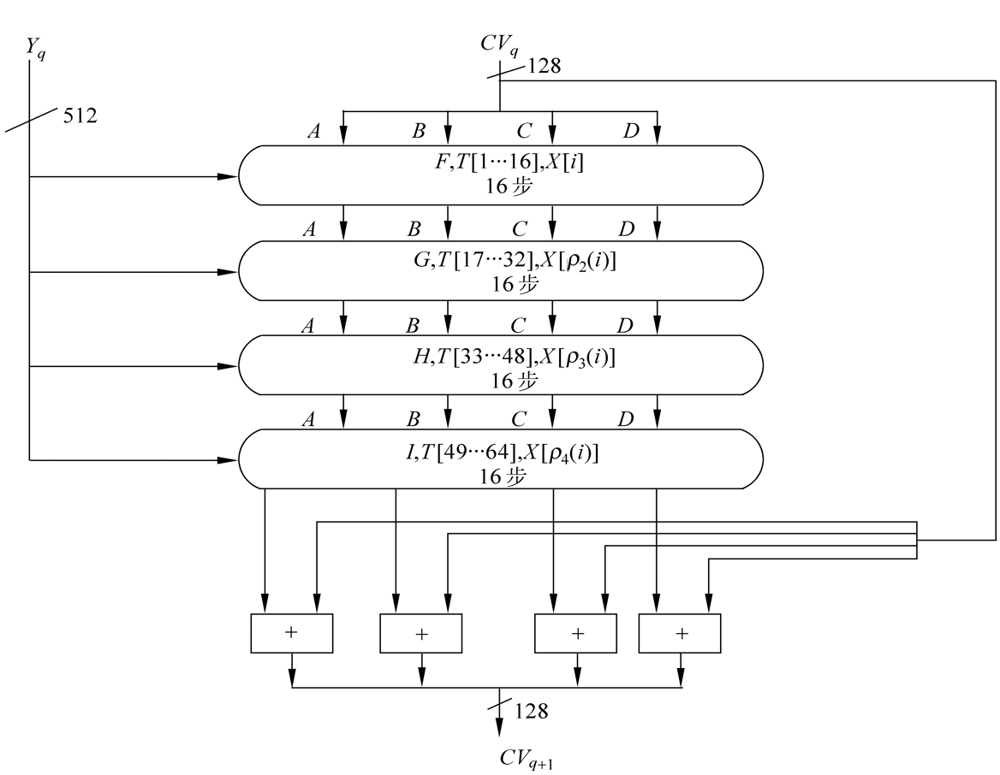 

   每轮所用逻辑函数分别为 F、G、H、I。

   每轮的输入为当前处理的消息分组 $Y_q$ 和缓冲区的当前值，输出仍放在缓冲区中，作为下一轮的输入。

   **每步运算**：$A←B+CLS_s(A + g(B,C,D) + X[k] + T[i])$

   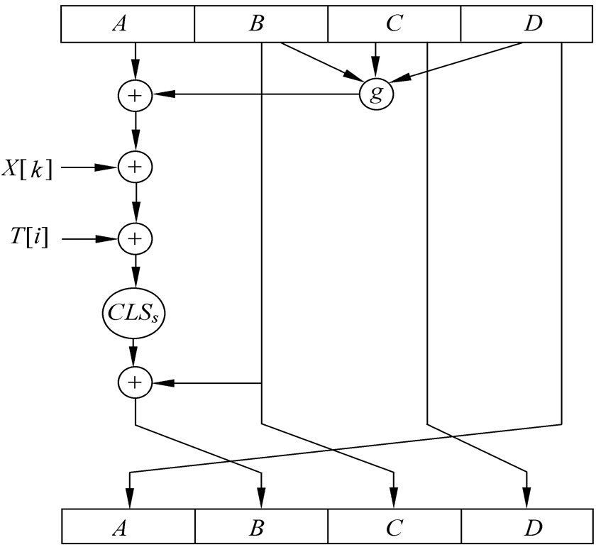 

   $+$ 为 $mod\ 2^{32}$ 加法。

   g 是基本逻辑函数 F、G 、H、I 之一，为逐比特逻辑运算。

   | 轮数 | 基本逻辑函数 |              g(B, C, D)              |
   | :--: | :----------: | :----------------------------------: |
   |  1   |  $F(B,C,D)$  | $(B\land C)\lor(\overline B\land D)$ |
   |  2   |  $G(B,C,D)$  | $(B\land D)\lor(C\land \overline D)$ |
   |  3   |  $H(B,C,D)$  |         $B\oplus C\oplus D$          |
   |  4   |  $I(B,C,D)$  |     $C\oplus (B\lor\overline D)$     |

   $CLS_s$ 是左循环移 s 位（s 取值见下表）。

   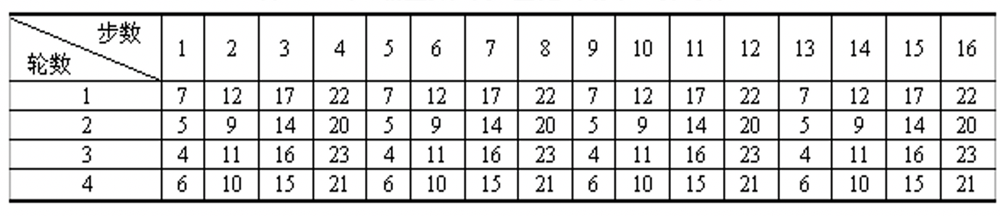 

   $X[k]=M[q\times16+k]$，即第 q 个分组中的第 k 个子组。每轮以不同的次序使用 16 个子组，第 1 轮以初始次序使用，第 2 轮到第 4 轮使用置换次序 i 后得的新次序：
   
   $\rho_2(i)=(1+5i)\ mod\ 16$
   
   $\rho_3(i)=(5+3i)\ mod\ 16$
   
   $\rho_4(i)=7i\ mod\ 16$
   
   每轮分别加上常数表 T 中元素 $T[1…16],\ T[17…32],\ T[33…48],\ T[49…64]$，表 T 第 i 个元素 T[i] 为 $232\times abs(\sin i)$ 的整数部分，i 以弧度为单位。

   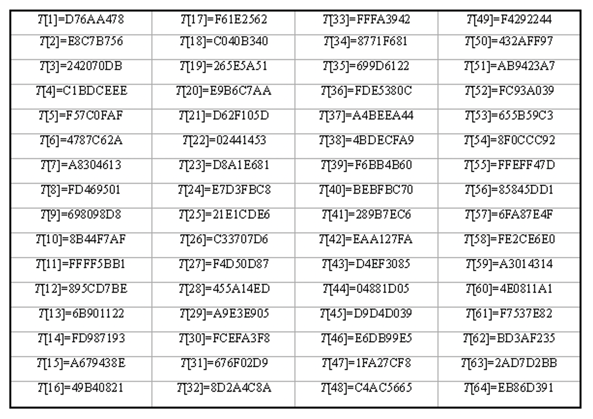 

   运算完成后再右循环一个字，即得这一步的输出。

   第 4 轮输出再与第 1 轮的输入 CV 按对应字 $mod\ 2^{32}$ 相加，得到此分组处理后的输出。

4. **输出**

   重复进行主循环，直到处理完所有分组。最后一个输出即为产生的消息摘要。

   $H(x)=A||B||C||D$

#### SHA

Secure Hash Algorithm 安全哈希算法

- SHA-0：Secure Hash Standard 安全哈希标准，很快被 NSA 撤回。
- SHA-1：在许多安全协议中广为使用。2017年被正式宣布攻破。
- SHA-2：包括 SHA-224、SHA-256、SHA-384、SHA-512、SHA-512/224、SHA-512/256。至今尚未出现对 SHA-2 有效的攻击。
- SHA-3：并非取代SHA-2，是与之前算法不同、可替换的加密哈希算法。

##### SHA-1

输入 $<2^{64}$ bits，分组长 512 bits。输出长 160 bits。

1. **填充**

   在消息后填充一个“1”和多个“0”，至 n × 512 bits - 64 bits。最后附上 64 bits 二进制最高有效字节优先表示的 $mod\  2^{64}$ 消息长度。

2. **初始化缓冲区**

   缓冲区由 5 个 32 bits 寄存器 A, B, C, D, E 组成，最高有效字节优先方式初始化为 A = 67 45 23 01, B = EF CD AB 89, C = 98 BA DC FB, D = 10 32 54 76, E = C3 D2 E1 F0。

3. **主循环**

   4 rounds × 20 steps
   
   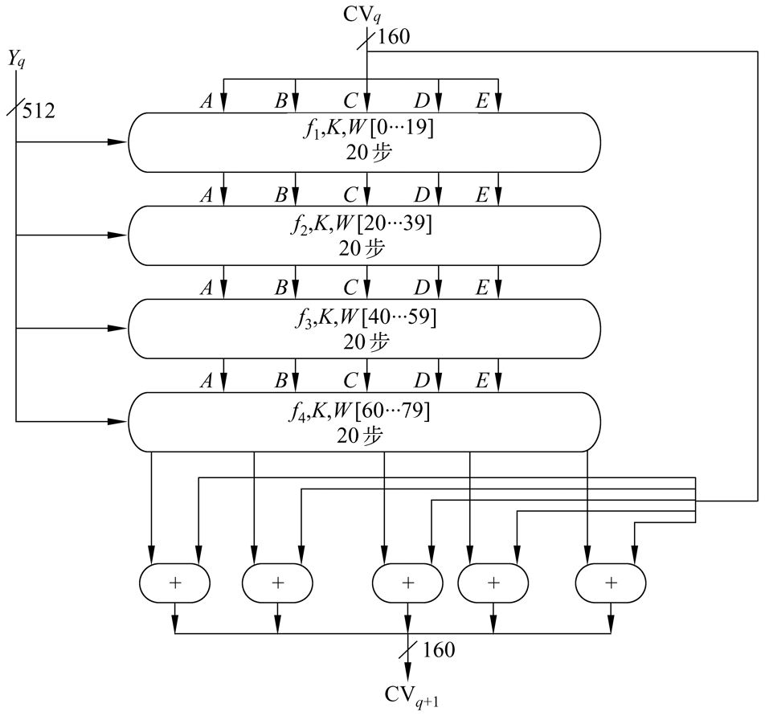
   
   每轮所用逻辑函数分别为 $f_1,\ f_2,\ f_3,\ f_4$。
   
   每轮的输入为当前处理的消息分组 $Y_q$ 和缓冲区的当前值，输出仍放在缓冲区中，作为下一轮的输入。
   
   **每步运算**：$A,B,C,D,E←(E+f_t(B,C,D)+CLS_5(A)+W_t+K_t),A, CLS_{30}(B),C,D$
   
   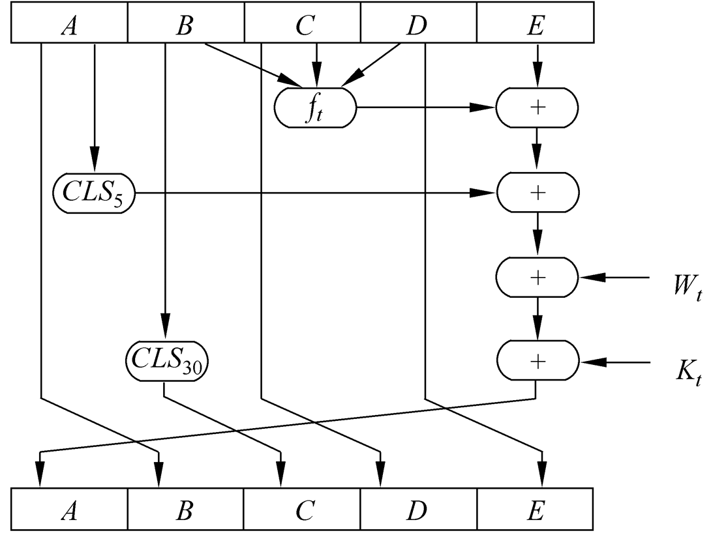
   
   t 为迭代步数，$0 ≤ t ≤ 79$。$+$ 为 $mod\ 2^{32}$ 加法。$CLS_s$ 为左循环移 s 位。
   
   $f_t(B,C,D)$ 为第 t 步使用的基本逻辑函数，为逐比特逻辑运算。
   
   |      步数       |     函数     |                   定义                   |
   | :-------------: | :----------: | :--------------------------------------: |
   | $0\le t\le 19$  | $f_1(B,C,D)$ |   $(B\land C)\lor(\overline B\land D)$   |
   | $20\le t\le 39$ | $f_2(B,C,D)$ |           $B\oplus C\oplus D$            |
   | $40\le t\le 59$ | $f_3(B,C,D)$ | $(B\land C)\lor(B\land D)\lor(C\land D)$ |
   | $60\le t\le 79$ | $f_4(B,C,D)$ |           $B\oplus C\oplus D$            |
   
   前 16 个 $W_t$ 直接取为当前分组的 16 个子组，其余由 $W_t=CLS_1(W_{t-16}\oplus W_{t-14}\oplus W_{t-8}\oplus W_{t-3})$ 计算得到。
   

   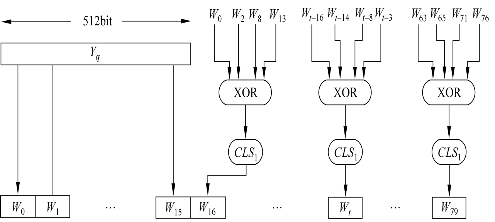

   $K_t$ 为加法常量，其中 $\lfloor x\rfloor$ 表示对 x 取整。

   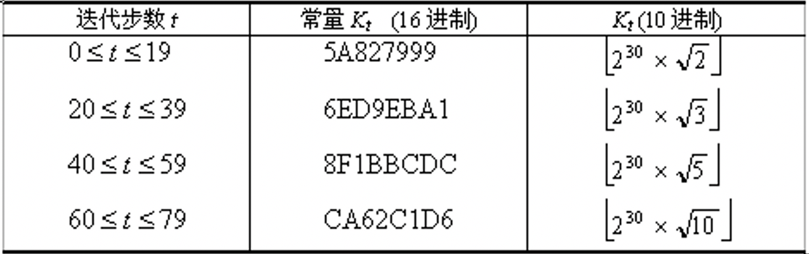

   第 4 轮输出再与第 1 轮的输入 CV 按对应字 $mod\ 2^{32}$ 相加，得到此分组处理后的输出。

4. **输出**

   重复进行主循环，直到处理完所有分组。最后一个输出即为产生的消息摘要。

   $H(x)=A\|B\|C\|D\|E$

##### SHA-2

包含 SHA-224、SHA-256、SHA-384、SHA-512、SHA-512/224、SHA-512/256。

SHA-512：

输入 $<2^{64}$ bits，分组长 512 bits。输出长 160 bits。

1. **填充**

   在消息后填充一个“1”和多个“0”，至 n × 1024 bits - 128 bits。最后附上 128 bits 二进制最高有效字节优先表示的 $mod\  2^{128}$ 消息长度。

2. **初始化缓冲区**

   缓冲区由 8 个 64 bits 寄存器 A, ..., H 组成，最高有效字节优先方式初始化为 A = 6A09E667F3BCC908, B = BB67AE8584CAA73B, C = 3C6EF372FE94F82B, D = A54FF53A5F1D36F1, E = 510E527FADE682D1, F = 9B05688C2B3E6C1F, G = 1F83D9ABFB41BD6B, H = 5BE0CD19137E2179，即取最小的 8 个素数的立方根的小数部分的前 64 bits。

3. **主循环**

   缓冲区初始值作为 $H_{i-1}$。每轮的输入为当前处理的消息分组 $M_i$ 和缓冲区的当前值，输出仍放在缓冲区中，作为下一轮的输入。

   80 轮循环。轮函数：
   
   $T_1 = H + Ch(E,F,G) + \sum_1^{512}E + W_t + K_t$
   $T_2 = \sum_0^{512}A + Maj(A,B,C)$
   $A = T_1 + T_2,\ B = A,\ C = B,\ D = C$
   $E = D + T_1,\ F=E,\ G=F,\ H=G$
   
   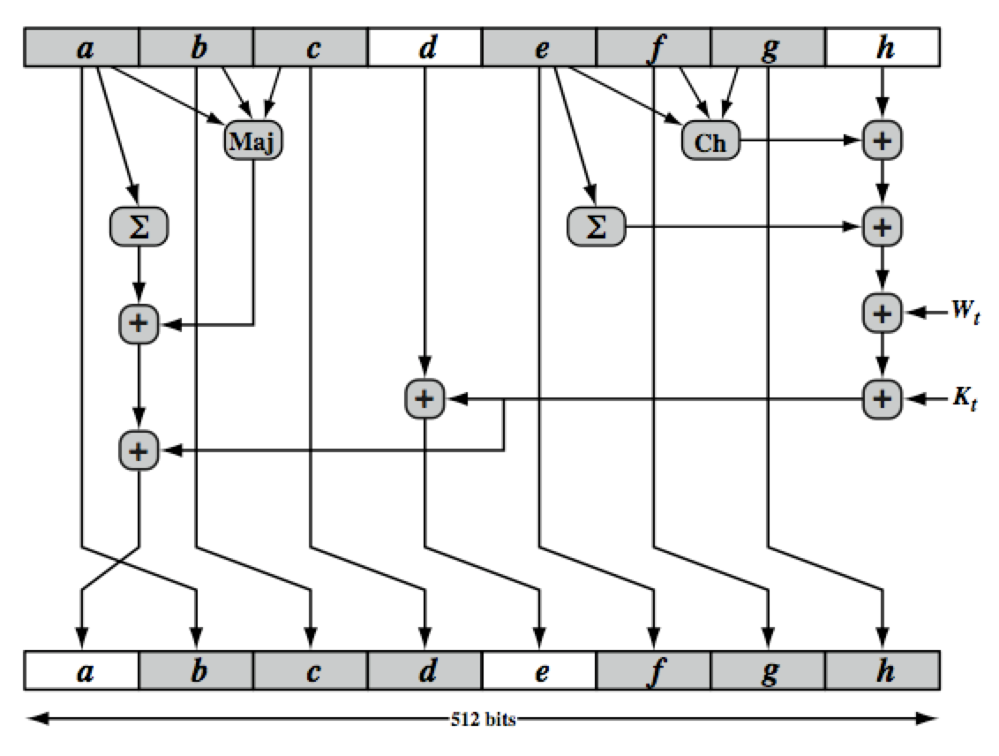

   t 为轮数，$0 ≤ t ≤ 79$。$+$ 为 $mod\ 2^{64}$ 加法。

   基本逻辑函数：
   
   - $Ch(E,F,G) = (E\land F)\oplus(\overline E \land G)$
   
   - $Maj(A,B,C) = (A\land B)\oplus(A\land C)\oplus(B\land C)$
   
   - $\sum_0^{512}A = ROTR^{28}(A)\oplus ROTR^{34}(A)\oplus ROTR^{39}(A)$
   
   - $\sum_1^{512}E = ROTR^{14}(E)\oplus ROTR^{18}(E)\oplus ROTR^{41}(E)$

   - $ROTR^i(X)$ 表示把 X 循环右移 i 位。

   $K_t$ 分别取最小的 80 个素数的立方根的小数部分的前 64 bits。

   前 16 个 $W_t$ 取自当前分组，其余按公式导出：$W_t = \sigma_1^{512}(W_{t-2}) + W_{t-7} + \sigma_0^{512}(W_{t-15}) + W_{t-16}$

   - $\sigma_1^{512}(\mathrm x) = ROTR^1(\mathrm x)\oplus ROTR^8(\mathrm x)\oplus SHR^7(\mathrm x)$
   
   - $\sigma_0^{512}(x) = ROTR^{19}(x)\oplus ROTR^{61}(x)\oplus SHR^6(x)$
   
   - $ROTR^n(x)$ 为 x 循环右移 n 位，$SHR^n(x)$ 为 x 左移 n 位，右边填充 0。

   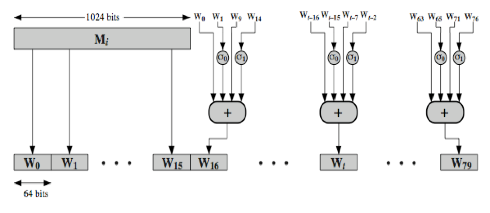

   第 80 轮的输出与第一轮的输入 $H_{i-1}$ 按对应字 $mod 2^{64}$ 相加产生 $H_i$。
   
   

#### HMAC

基于带密钥的 Hash 函数构造 MAC

**设计目标**

- 无需修改而使用现有 Hash 函数
- 能轻易替换为新的 Hash 函数

- 保持 Hash 函数的原有性能
- 使用和处理密钥的方式简单
- 易于分析 HMAC 用于认证时的密码强度

**算法**

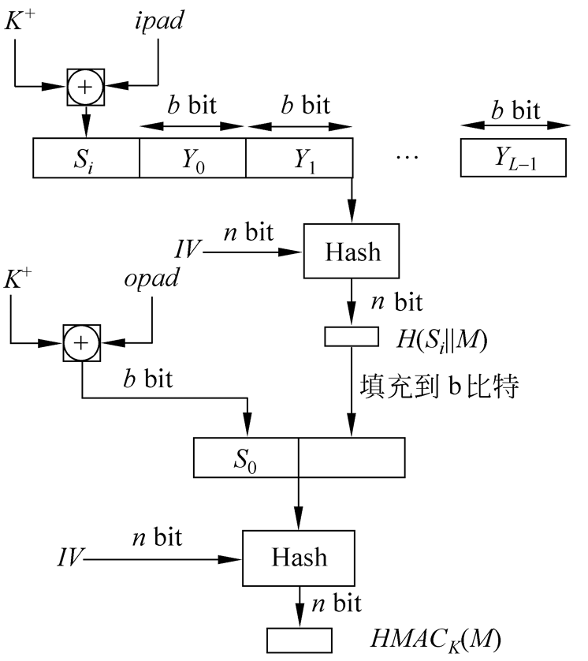

消息按 Hash 函数要求填充后作为输入 M。分组数 L，分组长度 b，$Y_i$ 是 M 的第 i 个分组，$0≤i≤L-1$。哈希值长度 $n\ (<b)$。

若密钥 K 长度大于 b，则输入到 Hash 函数转为 n bits。K 左边填充 0 得到长 b bits 的 $K^+$。

$ipad = 00110110,\ opad = 01011010$，逐字节运算。

1. $S_i = K^+\oplus ipad$
2. $H(S_i\|M)$
3. $S_o = K^+\oplus opad$
4. $HMAC_k = H[S_o\ \|\ H(S_i\|M)]$ （注意填充）

**有效实现**：

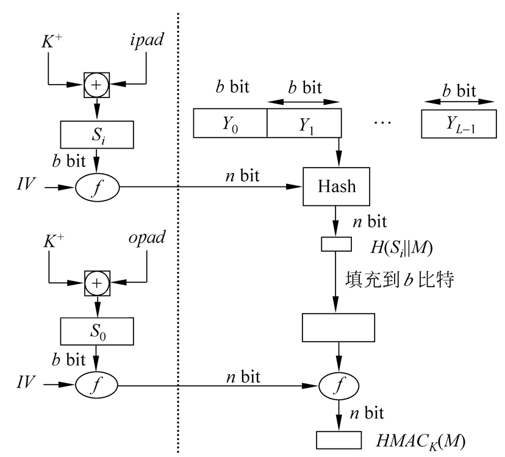

$f(CV,\ block)$ 是 Hash 函数中的压缩函数。

预先计算 $f(IV,\ S_i),\ f(IV,\ S_o)$，用于作为 Hash 函数的初值 IV。只在每次更改密钥时才需进行。

$S_i$ 和 $S_0$ 通过压缩函数处理，相当于以伪随机方式从 K 产生两个密钥。

**攻击**等价于：

- 计算 f 的一个输出，即使 IV 是随机的和秘密的。
- 找出 Hash 函数的碰撞，即使 IV 是随机的和秘密的。

### 4.5 Hash 函数的应用

**数字签名**

用来产生消息摘要 MDC。（见 4.3）

**公钥密码系统**

用于消息完整性验证。（见双钥密码体制）

**随机数发生器**

广泛用作实用的伪随机函数生成器。

密钥协商、认证协议、电子商务协议、知识证明协议…… 
